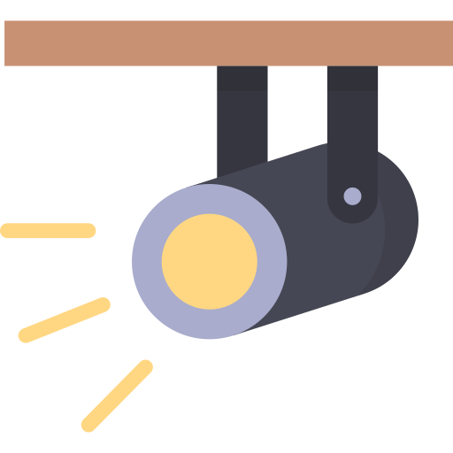

# SpotLight On

**Share the code, share the love.**

Hi, I'm software developer working on browser-based tools and 3D experiments.

## Projects

- [SVG forge](https://svgforge.github.io) — Browser-based SVG tools and experiments.
- [Todo Snake](https://github.com/SpotlightOn/todo-snake) My Todo Manager (Python + Pyside6).
- [Meshviewer](https://github.com/spotlighton/meshviewer) — Coming soon! Interactive Electron app: a 3D mesh viewer for glTF.

## About me

- 💻 Passionate about languages, frameworks, and tooling
- 🌱 Always learning something new
- 📖 Enjoy contributing to open-source and sharing knowledge with the community
- 💜 Favorite quote - The Zen of Python (PEP 20)
